# KG4PO v2 — Complete System Specification
### Quality-Aware Knowledge-Grounded Self-Reflective Prompt Optimization for LLM-Based Sequential Recommendation

> 📌 **Tài liệu tham chiếu duy nhất** cho toàn bộ hệ thống KG4PO v2.
> Mọi chi tiết từ input → Stage 1 → Stage 2 → output đều được mô tả đầy đủ.

---

## Mục lục

1. [Tổng quan kiến trúc](#1-tổng-quan-kiến-trúc)
2. [Input — Dữ liệu đầu vào](#2-input--dữ-liệu-đầu-vào)
3. [Stage 1 — Knowledge Graph Pipeline](#3-stage-1--knowledge-graph-pipeline)
   - [1.1 Data Loading & Schema Detection](#step-11--data-loading--schema-detection)
   - [1.2 Graph Building (CKGraph)](#step-12--graph-building-ckgraph)
   - [1.3 Node Embedding](#step-13--node-embedding)
   - [1.4 Attention Propagation 🔄](#step-14--attention-propagation--cải-tiến)
   - [1.5 Top-K Selection & 2-Hop Inference](#step-15--top-k-selection--2-hop-inference)
   - [1.6 Text Synthesis](#step-16--text-synthesis)
   - [1.7 Knowledge Quality Gateway 🆕](#step-17--knowledge-quality-gateway-)
4. [Intermediate Output — context.jsonl](#4-intermediate-output--contextjsonl)
5. [Stage 2 — Self-Reflective Prompt Optimization](#5-stage-2--self-reflective-prompt-optimization)
   - [2.1 Batch Loading](#step-21--batch-loading)
   - [2.2 Recommender Agent 🔄](#step-22--recommender-agent--cải-tiến)
   - [2.3 Reflector Agent 🆕](#step-23--reflector-agent-)
   - [2.4 Metrics Evaluation](#step-24--metrics-evaluation)
   - [2.5 Position-Aware KG Error Analyzer 🆕](#step-25--position-aware-kg-error-analyzer-)
   - [2.6 Optimizer Agent 🔄](#step-26--optimizer-agent--cải-tiến)
   - [2.7 Metric-Gated Prompt Acceptance 🆕](#step-27--metric-gated-prompt-acceptance-)
   - [2.8 Persistence & Error Bank 🔄](#step-28--persistence--error-bank--cải-tiến)
6. [Testing Phase](#6-testing-phase)
7. [Output — Kết quả cuối cùng](#7-output--kết-quả-cuối-cùng)
8. [Ablation Study Plan](#8-ablation-study-plan)
9. [File Changes — Danh sách file cần thay đổi](#9-file-changes)
10. [Hyperparameters Reference](#10-hyperparameters-reference)

---

## 1. Tổng quan kiến trúc

```mermaid
graph TB
    subgraph INPUT["📥 INPUT"]
        RAW_SESSION["train.json / test.json<br/>(Session History + Candidates)"]
        RAW_INFO["info_*.json<br/>(Product Metadata)"]
    end

    subgraph STAGE1["🧠 STAGE 1 — Knowledge Graph Pipeline"]
        direction TB
        S1_1["1.1 Data Loading<br/>& Schema Detection"]
        S1_2["1.2 Graph Building<br/>(CKGraph)"]
        S1_3["1.3 Node Embedding<br/>(Sentence-Transformers)"]
        S1_4["🔄 1.4 Attention Propagation<br/>(Projection-Free)"]
        S1_5["1.5 Top-K Selection<br/>& 2-Hop Inference"]
        S1_6["1.6 Text Synthesis"]
        S1_7["🆕 1.7 Knowledge Quality Gateway<br/>(IDF Filter + Scoring + Confidence)"]
        S1_1 --> S1_2 --> S1_3 --> S1_4 --> S1_5 --> S1_6 --> S1_7
    end

    subgraph INTERMEDIATE["📄 INTERMEDIATE OUTPUT"]
        CONTEXT["*.context.jsonl<br/>(input + quality-aware retrieved_knowledge<br/>+ knowledge_quality + knowledge_confidence)"]
    end

    subgraph STAGE2["🤖 STAGE 2 — Self-Reflective Prompt Optimization"]
        direction TB
        S2_1["2.1 Batch Loading"]
        S2_2["🔄 2.2 Recommender Agent<br/>(+ retry + quality-aware prompt)"]
        S2_3["🆕 2.3 Reflector Agent<br/>(KG-Grounded Self-Reflection)"]
        S2_4["2.4 Metrics Evaluation"]
        S2_5["🆕 2.5 Position-Aware<br/>KG Error Analyzer"]
        S2_6["🔄 2.6 Optimizer Agent<br/>(KG-grounded feedback)"]
        S2_7["🆕 2.7 Metric-Gated<br/>Prompt Acceptance"]
        S2_8["🔄 2.8 Persistence<br/>& Error Bank"]
        S2_1 --> S2_2 --> S2_3 --> S2_4 --> S2_5 --> S2_6 --> S2_7 --> S2_8
        S2_8 -.->|"Next Batch"| S2_1
    end

    subgraph OUTPUT["📈 OUTPUT"]
        BEST_PROMPT["best_system_prompt.txt"]
        RESULTS["Test Results CSV<br/>(NDCG, HIT, MAP @K)"]
    end

    RAW_SESSION --> S1_1
    RAW_INFO --> S1_1
    S1_7 --> CONTEXT
    CONTEXT --> S2_1
    S2_8 --> BEST_PROMPT
    BEST_PROMPT --> RESULTS

    style S1_7 fill:#ff6b6b,color:#fff
    style S2_3 fill:#ff6b6b,color:#fff
    style S2_5 fill:#ff6b6b,color:#fff
    style S2_7 fill:#ff6b6b,color:#fff
    style S1_4 fill:#ffa94d,color:#fff
    style S2_2 fill:#ffa94d,color:#fff
    style S2_6 fill:#ffa94d,color:#fff
    style S2_8 fill:#ffa94d,color:#fff
```

> 🔴 Đỏ = Module mới hoàn toàn | 🟠 Cam = Module cải tiến từ v1

### Paper Contributions (5 điểm)

| # | Contribution | Novelty source |
|---|-------------|----------------|
| C1 | **Self-Reflective Reranking** grounded by KG evidence | Giải quyết "degeneration of thought" (ICLR'25) bằng external KG grounding |
| C2 | **Position-Aware KG-Grounded Error Analysis** | Mở rộng AGP (CIKM'24) bằng structured knowledge |
| C3 | **Metric-Gated Prompt Evolution** với rollback | Convergence guarantee cho prompt optimization |
| C4 | **Knowledge Quality Gateway** (IDF filter + adaptive confidence) | Giải quyết fragility khi KG data sparse/noisy |
| C5 | **Unified Quality-Aware KG-LLM Framework** end-to-end | Unified pipeline chưa có trong literature |

---

## 2. Input — Dữ liệu đầu vào

### 2.1 Session Data (`train.json` / `test.json`)

JSON array, mỗi phần tử là 1 session recommendation task:

```json
{
    "target": "Frankenstein (1931)",
    "target_index": 7,
    "input": "Current session interactions: [1.\"The Body Snatcher (1945)\", 2.\"Dracula (1931)\", 3.\"The Mummy (1932)\"]\nCandidate Set: [1.\"Toy Story (1995)\", 2.\"Aladdin (1992)\", ..., 20.\"Frankenstein (1931)\"]"
}
```

| Field | Type | Ý nghĩa |
|-------|------|---------|
| `target` | string | Ground truth — item user sẽ tương tác tiếp |
| `target_index` | int | Vị trí target trong candidate set (0-indexed) |
| `input` | string | 2 phần: session history (items user đã xem) + candidate set (20 items cần rerank) |

### 2.2 Product Info (`info_*.json`)

Metadata cho toàn bộ sản phẩm. Hệ thống tự detect 2 formats:

**Format TAXONOMY** (ML-100K, Bundle):
```json
{
    "title": "Toy Story (1995)",
    "taxonomy": {
        "Level_1": "Animation",
        "Level_2": "Children's Animation",
        "Level_3": "Family Comedy"
    },
    "details": {
        "description": "A cowboy doll is profoundly threatened...",
        "keywords": ["animation", "toys", "friendship"]
    }
}
```

**Format CATEGORY** (Games, ML-1M):
```json
{
    "title": "The Legend of Zelda",
    "category": ["Action RPG", "Adventure", "Nintendo"],
    "details": {
        "description": "An action-adventure game...",
        "keywords": ["zelda", "nintendo", "adventure"]
    }
}
```

### 2.3 Datasets

| Dataset | Domain | Items | Schema | Paths |
|---------|--------|-------|--------|-------|
| ML-100K | Movies | ~1,682 | TAXONOMY | `data/ml_100k/` |
| ML-1M | Movies | ~3,706 | CATEGORY | `data/ml_1m/` |
| Games | Video Games | varies | CATEGORY | `data/games/` |
| Bundle | E-commerce | varies | TAXONOMY | `data/bundle/` |

---

## 3. Stage 1 — Knowledge Graph Pipeline

> **Entry point**: [KG_processed/main.py](file:///d:/H_temp/KG4PO/KG_processed/main.py)
> **Config**: [KG_processed/config.yaml](file:///d:/H_temp/KG4PO/KG_processed/config.yaml)

Stage 1 chuyển đổi raw data thành **quality-aware retrieved_knowledge** cho mỗi session. Gồm 7 bước tuần tự.

---

### Step 1.1 — Data Loading & Schema Detection

> **Files**: [loader.py](file:///d:/H_temp/KG4PO/KG_processed/src/data/loader.py), [schema_detector.py](file:///d:/H_temp/KG4PO/KG_processed/src/data/schema_detector.py)
> **Status**: Không thay đổi

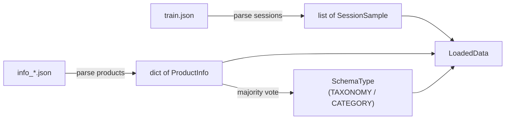

**Xử lý chi tiết**:

1. **Parse sessions**: Đọc JSON, tách `input` string thành 2 lists:
   - `session_items` = regex `\d+\."([^"]+)"` trên phần trước `\nCandidate Set:`
   - `candidate_items` = regex trên phần sau

2. **Parse products**: Đọc JSON array, mỗi entry → `ProductInfo`:
   - Title (normalized lowercase cho lookup)
   - Categories list HOẶC taxonomy levels dict
   - Description string (optional)
   - Keywords list (optional)

3. **Schema Detection**: Scan tất cả products:
   - Có field `taxonomy` với `Level_*` keys → TAXONOMY
   - Có field `category` → CATEGORY
   - Vote majority → chọn schema type cho toàn corpus

**Output**: `LoadedData(samples, products, corpus_schema)`

---

### Step 1.2 — Graph Building (CKGraph)

> **Files**: [builder.py](file:///d:/H_temp/KG4PO/KG_processed/src/graph/builder.py), [triplet_extractor.py](file:///d:/H_temp/KG4PO/KG_processed/src/graph/triplet_extractor.py), [co_occur_handler.py](file:///d:/H_temp/KG4PO/KG_processed/src/graph/co_occur_handler.py)
> **Status**: Không thay đổi

Build **Collaborative Knowledge Graph (CKG)** từ 2 nguồn triplets:

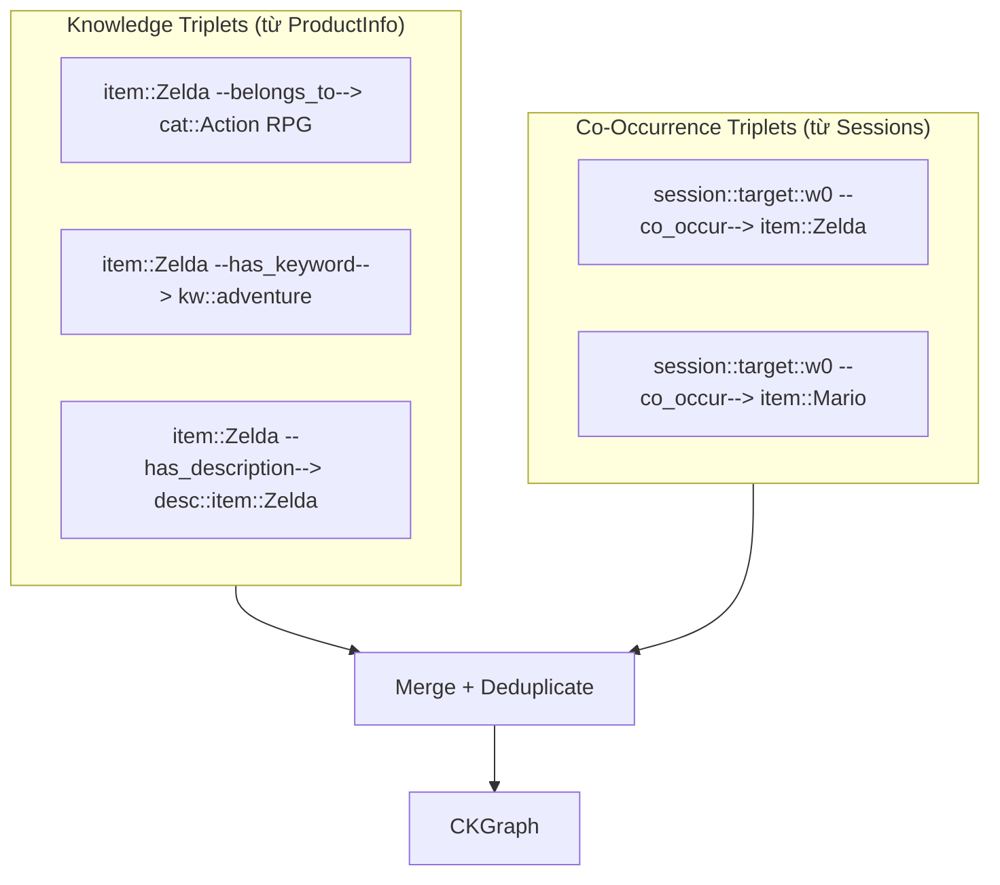

#### 1.2a — Knowledge Triplet Extraction

Duyệt từng product, tạo triplets dựa trên schema:

| Schema | Relation | Example |
|--------|----------|---------|
| TAXONOMY | `belongs_to_L1`, `belongs_to_L2`, ... | `item::Toy Story → cat::Animation` |
| CATEGORY | `belongs_to` | `item::Zelda → cat::Action RPG` |
| (optional) | `has_description` | `item::Zelda → desc::item::Zelda` |
| (optional) | `has_keyword` | `item::Zelda → kw::adventure` |

**Node ID convention**: `item::<title>`, `cat::<label>`, `kw::<keyword>`, `desc::item::<title>`, `session::<target>::<suffix>`

#### 1.2b — Co-Occurrence Triplet Extraction

Dùng **Session Node** làm intermediary (O(n) edges thay vì O(n²)):

**Sliding Window** (default `window_size=5`):
```
Session [A, B, C, D, E, F, G, H]:
  Window 0: session::target::w0 → {A, B, C, D, E}
  Window 1: session::target::w1 → {F, G, H}
```

**Full Session** (`window_size=null`):
```
Session [A, B, C, D]: session::target::full → {A, B, C, D}
```

#### 1.2c — Assemble CKGraph

```python
CKGraph:
  triplets:       list[Triplet]                   # Tất cả (h, r, t) edges
  adjacency:      dict[head → [(rel, tail)]]      # Outgoing edges
  reverse_adj:    dict[tail → [(rel, head)]]      # Incoming edges
  node_types:     dict[node_id → NodeType]         # item/session/category/keyword/description
  item_nodes:     set[str]
  session_nodes:  set[str]
  category_nodes: set[str]
```

---

### Step 1.3 — Node Embedding

> **File**: [node_embedder.py](file:///d:/H_temp/KG4PO/KG_processed/src/embedding/node_embedder.py)
> **Status**: Không thay đổi

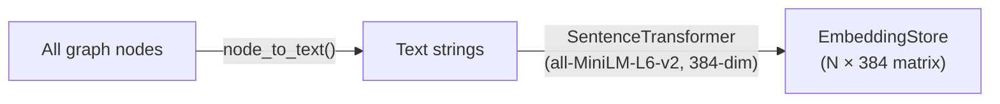

**Node → Text mapping**:

| Node Type | Node ID | Generated Text |
|-----------|---------|----------------|
| ITEM | `item::Toy Story` | `"Title: Toy Story"` |
| CATEGORY | `cat::Animation` | `"Category: Animation"` |
| KEYWORD | `kw::adventure` | `"Keyword: adventure"` |
| DESCRIPTION | `desc::item::Toy Story` | `"Description: A cowboy doll..."` |
| SESSION | `session::target::w0` | `"Viewing session context"` |

- Batch encoding (256/batch), L2-normalized
- GPU acceleration khi available
- Output: `EmbeddingStore` với `matrix` (N×384) + `node2idx`/`idx2node` maps

---

### Step 1.4 — Attention Propagation (🔄 cải tiến)

> **Files**: [attention_scorer.py](file:///d:/H_temp/KG4PO/KG_processed/src/attention/attention_scorer.py), [propagation.py](file:///d:/H_temp/KG4PO/KG_processed/src/attention/propagation.py)
> **Status**: 🔄 CẢI TIẾN — Projection-Free Aggregation

KGAT-style message passing qua L layers trên graph.

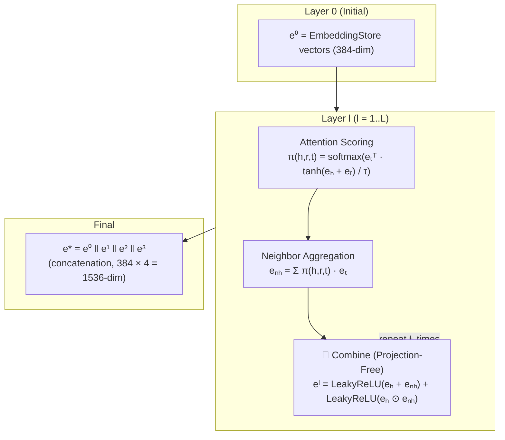

#### 1.4a — Attention Scoring

Cho node `h` và neighbor `t` connected qua relation `r`:

```
score(h, r, t) = eₜᵀ · tanh(eₕ + eᵣ)
```

`eᵣ` = mean embedding của tất cả tail nodes connected qua relation `r` (pre-computed).

Normalize bằng softmax với temperature `τ`:
```
π(h, r, t) = exp(score/τ) / Σ_t' exp(score(h,r,t')/τ)
```

#### 1.4b — Neighbor Aggregation

```
eₙₕ = Σ_t π(h,r,t) · eₜ     (attention-weighted sum)
```

#### 1.4c — Combine (🔄 THAY ĐỔI: Projection-Free)

**V1 (cũ)**: Dùng random weight matrices W₁, W₂ (chưa bao giờ được train):
```
e_new = LeakyReLU(W₁·(eₕ + eₙₕ)) + LeakyReLU(W₂·(eₕ ⊙ eₙₕ))
→ Random projection gây noise, non-reproducible
```

**V2 (mới)**: Bỏ weight matrices, dùng direct aggregation:
```
e_new = LeakyReLU(eₕ + eₙₕ) + LeakyReLU(eₕ ⊙ eₙₕ)
→ Giữ nguyên semantic, no noise, reproducible
```

Config toggle:
```yaml
propagation:
  use_projection: false  # false = projection-free (v2), true = with W matrices (v1)
```

#### 1.4d — Dropout

Inverted dropout (rate=0.1) — áp dụng giữa các layers.

#### 1.4e — Final Embedding

Concatenate all layers: `e* = e⁰ ‖ e¹ ‖ ... ‖ eᴸ`
- L=3, dim=384 → final dim = 384 × 4 = 1,536

**Output**: `PropagationResult`:
- `layer_embeddings[l][node_id]` — embedding tại mỗi layer
- `attention_records[l][head_id]` → `[(rel, tail, weight)]`
- `final_embeddings[node_id]` — concatenated

---

### Step 1.5 — Top-K Selection & 2-Hop Inference

> **File**: [topk_selector.py](file:///d:/H_temp/KG4PO/KG_processed/src/retrieval/topk_selector.py)
> **Status**: Không thay đổi

Chọn K neighbors quan trọng nhất per item + **infer items** qua 2-hop paths.

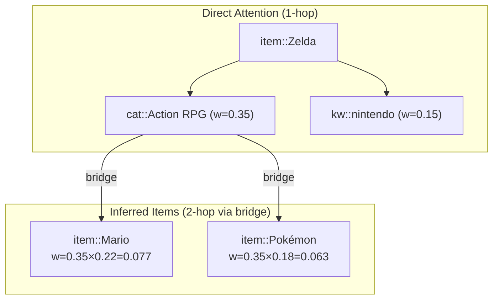

#### 1.5a — Direct Weight Aggregation

Tổng hợp attention weights qua tất cả layers với layer decay:
```python
accumulated[tail] += weight × (layer_decay ^ layer_idx)
# layer_decay=0.9 → shallow layers ưu tiên hơn
```

Phân loại theo node type → lấy top-K mỗi loại:
- `top_categories` (k=6)
- `top_keywords` (k=3)
- `top_descriptions` (k=1)

#### 1.5b — 2-Hop Inferred Items

Tìm items **không trong session** nhưng connected qua shared category/keyword (bridge nodes):

```
item::Zelda --[belongs_to]--> cat::Action RPG <--[belongs_to]-- item::Mario
  w(focal→bridge) = 0.35        bridge node         w(bridge→item) = 0.22

inferred_score(Zelda → Mario) = 0.35 × 0.22 = 0.077
```

- Loại items đã có trong session
- Lấy top `k_inferred_items=3`

**Output**: `TopKResult` per item → `{top_categories, top_keywords, top_inferred_items, top_descriptions}`

---

### Step 1.6 — Text Synthesis

> **File**: [text_synthesizer.py](file:///d:/H_temp/KG4PO/KG_processed/src/retrieval/text_synthesizer.py)
> **Status**: 🔄 Sẽ modify (tích hợp IDF filter từ Step 1.7)

Biến `TopKResult` thành **natural language snippet** cho LLM:

**Template per item**:
```
- Item '<title>' belong to categories: <C1>, <C2>; with keywords: <K1>, <K2>; related items: <I1>, <I2>.
```

**Logic**:
1. Duyệt từng item trong session
2. Nếu có TopKResult → build snippet từ graph attention:
   - Categories: most specific (longest name) + top weights → max 4
   - Keywords: từ graph attention → max 3
   - Inferred items: từ 2-hop → max 3
3. Nếu không có TopKResult → fallback sang ProductInfo
4. Worst case: `"- Item '<title>'."` (chỉ tên, không có context)

**Ví dụ output cho 1 session**:
```
- Item 'The Body Snatcher' belong to categories: Gothic Romances, Horror; 
  with keywords: horror, thriller; related items: Dracula, Frankenstein.
- Item 'Dracula' belong to categories: Horror, Classic Horror; 
  related items: The Mummy, Nosferatu.
- Item 'The Mummy' belong to categories: Horror, Adventure Horror; 
  related items: Indiana Jones.
```

---

### Step 1.7 — Knowledge Quality Gateway (🆕)

> **Files MỚI**: `KG_processed/src/retrieval/idf_calculator.py`, `core/knowledge_quality.py`
> **Status**: 🆕 MỚI HOÀN TOÀN

**Vấn đề đã phát hiện từ dữ liệu thực**:

| Vấn đề | Bằng chứng | Impact |
|--------|-----------|--------|
| Categories không phân biệt | Games: "Legacy Systems" trong **211%** samples | LLM dùng noise để rank |
| Knowledge mỏng | Games: **42%** samples chỉ có KG cho 1 item | LLM thiếu session context |
| Thiếu keywords | Games & ML-1M: **100%** không có keywords | Mất semantic detail |
| Không quality-aware | LLM xử lý mọi knowledge như nhau | Over-rely on bad knowledge |

KQG giải quyết bằng 3 components tuần tự:

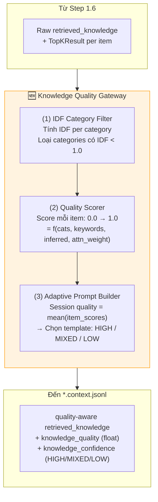

#### Component 1: IDF-Based Non-Discriminative Category Filter

Loại bỏ categories quá phổ biến (không mang thông tin phân biệt):

```python
IDF(category) = log(N_total_items / df(category))
# df = số items thuộc category đó

if IDF < threshold (default 1.0):
    → LOẠI BỎ (non-discriminative)
```

**Ví dụ Games dataset** (N≈3000):

| Category | df (est.) | IDF | Verdict |
|----------|-----------|-----|---------|
| Legacy Systems | ~2800 | 0.07 | ❌ Loại — hầu hết items đều có |
| PlayStation Systems | ~1200 | 0.92 | ❌ Loại — quá phổ biến |
| PlayStation 4 | ~400 | 2.01 | ✅ Giữ |
| Action RPG | ~45 | 4.20 | ✅ Giữ — discriminative |

**Kết quả**:
```
TRƯỚC: "Item 'Zelda' belong to categories: Legacy Systems, Nintendo Systems, GameCube, Action RPG"
                                            ↑ noise          ↑ noise          ↑ ok       ↑ tốt
SAU:   "Item 'Zelda' belong to categories: GameCube, Action RPG"
                                            ✅                ✅
```

#### Component 2: Per-Item Quality Scorer

Chấm điểm chất lượng KG knowledge cho mỗi item (0.0–1.0):

```python
def score_item_quality(filtered_categories, top_keywords, 
                       top_inferred_items, avg_attention_weight) -> float:
    score = 0.0
    score += min(len(filtered_categories) / 3, 0.30)     # Discriminative categories
    score += min(len(top_keywords) / 3, 0.20)             # Keyword coverage
    score += min(len(top_inferred_items) / 2, 0.25)       # Graph inference
    score += min(avg_attention_weight * 2, 0.25)           # Attention strength
    return score  # [0.0, 1.0]
```

| Score range | Level | Ý nghĩa |
|-------------|-------|---------|
| ≥ 0.7 | HIGH 🟢 | Rich: categories + keywords + inferred items |
| 0.3–0.7 | MEDIUM 🟡 | Partial: có một số thông tin hữu ích |
| < 0.3 | LOW 🔴 | Poor: thiếu hoặc toàn noise |

**Session quality** = `mean(item_scores)` cho tất cả items trong session.

#### Component 3: Adaptive Prompt Builder

Dựa trên session quality level, tạo retrieved_knowledge với **confidence marker**:

**HIGH (≥ 0.7)** — LLM được khuyến khích dựa mạnh vào KG:
```
3. Knowledge Graph Context [CONFIDENCE: HIGH]:
   The following KG knowledge can be reliably used for ranking decisions:
   ✓ Item 'Zelda' belong to categories: Action RPG, Adventure; 
     related items: Mario, Dark Souls.
   ✓ Item 'Mario' belong to categories: Platformer, Family; 
     related items: Kirby, Donkey Kong.
```

**MIXED (0.3–0.7)** — LLM biết item nào tin được, item nào không:
```
3. Knowledge Graph Context [CONFIDENCE: MIXED]:
   Some items have rich KG data (✓), others limited (~).
   Rely more on session patterns for items marked (~).
   ✓ Item 'Zelda' belong to categories: Action RPG; related items: Mario.
   ~ Item 'FIFA 21' belong to categories: PlayStation 4.  [LIMITED]
```

**LOW (< 0.3)** — LLM được chỉ dẫn ưu tiên session patterns:
```
3. Knowledge Graph Context [CONFIDENCE: LOW]:
   ⚠️ KG coverage is LIMITED for this session.
   IMPORTANT: Prioritize session sequential patterns over KG context.
   ~ Item 'GameX'.  [NO DATA]
```

---

## 4. Intermediate Output — context.jsonl

Mỗi dòng là 1 JSON object (**format v2**):

```json
{
    "target": "Frankenstein (1931)",
    "target_index": 7,
    "input": "Current session interactions: [...]\nCandidate Set: [...]",
    "retrieved_knowledge": "✓ Item 'The Body Snatcher' belong to categories: Horror, Gothic; related items: Dracula. ✓ Item 'Dracula' belong to categories: Horror Classic; related items: Nosferatu.",
    "knowledge_quality": 0.72,
    "knowledge_confidence": "HIGH"
}
```

| Field | V1 | V2 (new) |
|-------|-----|---------|
| `target` | ✅ | ✅ (không đổi) |
| `target_index` | ✅ | ✅ (không đổi) |
| `input` | ✅ | ✅ (không đổi) |
| `retrieved_knowledge` | Raw text, no quality markers | 🆕 IDF-filtered + quality markers (✓/~) |
| `knowledge_quality` | ❌ | 🆕 Float [0.0, 1.0] |
| `knowledge_confidence` | ❌ | 🆕 "HIGH" / "MIXED" / "LOW" |

---

## 5. Stage 2 — Self-Reflective Prompt Optimization

> **Entry points**: [main.py](file:///d:/H_temp/KG4PO/main.py) (train), [test.py](file:///d:/H_temp/KG4PO/test.py) (test)

### Training Loop Overview

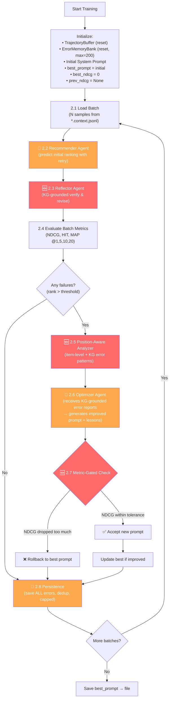

---

### Step 2.1 — Batch Loading

> **File**: [main.py](file:///d:/H_temp/KG4PO/main.py)
> **Status**: 🔄 Minor change (read new quality fields)

Load `*.context.jsonl` theo streaming batches:
```python
batch_size = 5        # Số samples mỗi batch
max_batches = None    # None = toàn bộ dataset
```

Mỗi sample được parse:
```python
# Parse input string
parts = input_str.split('\nCandidate Set:')
session_str = parts[0].replace('Current session interactions:', '').strip()
candidate_str = parts[1].strip()
session_items = re.findall(r'\d+\."([^"]+)"', session_str)

# V2: thêm quality fields
knowledge_quality = item.get('knowledge_quality', 0.5)
knowledge_confidence = item.get('knowledge_confidence', 'MIXED')
```

---

### Step 2.2 — Recommender Agent (🔄 cải tiến)

> **File**: [recommender_agent.py](file:///d:/H_temp/KG4PO/agents/recommender_agent.py)
> **Status**: 🔄 CẢI TIẾN — retry logic + quality-aware prompt + return reasoning

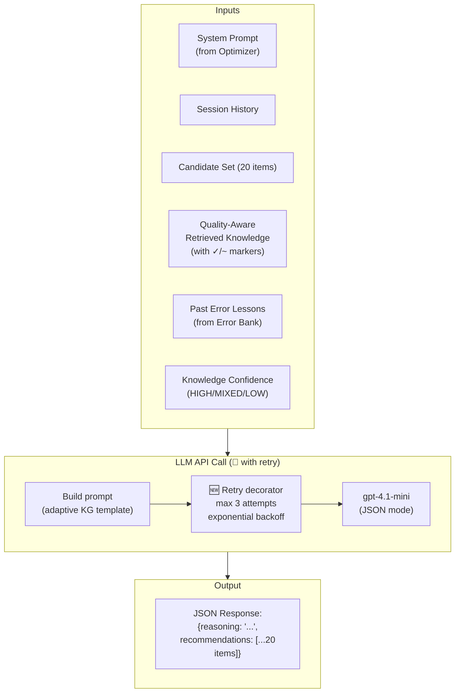

**Prompt structure thay đổi**:

```
┌─────────── SYSTEM MESSAGE ───────────────┐
│ {system_prompt}                           │
│ (Dynamic — optimized by Optimizer Agent)  │
├─────────── HUMAN MESSAGE ────────────────┤
│ This is a {domain} recommendation task.   │
│                                           │
│ 1. Session History:                       │
│    {session_items}                        │
│                                           │
│ 2. Candidate Set (RERANK THESE 20):       │
│    {candidate_set}                        │
│                                           │
│ 3. Knowledge Graph Context                │
│    [CONFIDENCE: {confidence_level}]:      │  ← 🆕 confidence marker
│    {quality_aware_retrieved_knowledge}    │  ← 🆕 ✓/~ markers
│    {adaptive_instruction}                │  ← 🆕 tùy level
│                                           │
│ 4. Past Errors to Avoid:                  │
│    {past_errors}                          │
│                                           │
│ Return JSON with reasoning + 20 items     │
└───────────────────────────────────────────┘
```

**🆕 Retry Logic**:
```python
@retry_with_backoff(max_retries=3, base_delay=2.0)
def predict(self, ...) -> dict:
    # Call LLM → parse JSON
    # Nếu JSONDecodeError hoặc API error → exception → auto retry
    # Return: {"reasoning": "...", "recommendations": [...]}
```

**🆕 Return reasoning**: V2 trả về cả `reasoning` (không chỉ recommendations) → cho Reflector Agent dùng.

---

### Step 2.3 — Reflector Agent (🆕)

> **File MỚI**: `agents/reflector_agent.py`
> **Status**: 🆕 MỚI HOÀN TOÀN — **Contribution chính (C1)**

Sau initial prediction, Reflector Agent **tự verify và sửa ranking** bằng KG evidence:

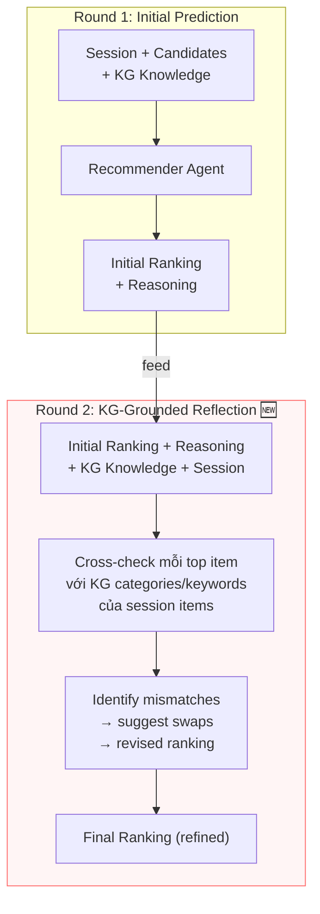

**Reflector Prompt**:

```
┌─────────── SYSTEM MESSAGE ────────────────────┐
│ You are a Recommendation Verifier.             │
│ Review and improve an initial ranking by       │
│ cross-checking it against Knowledge Graph.     │
│                                                │
│ Identify:                                      │
│ 1. Items ranked too high despite KG attribute  │
│    mismatches with session                     │
│ 2. Items ranked too low despite strong KG      │
│    alignment with session                      │
│ 3. Provide swap suggestions with KG            │
│    justification                               │
├─────────── HUMAN MESSAGE ─────────────────────┤
│ SESSION HISTORY: {session_items}               │
│ KG CONTEXT: {retrieved_knowledge}              │
│ INITIAL RANKING: {initial_ranking}             │
│ INITIAL REASONING: {initial_reasoning}         │
│ CANDIDATE SET: {candidate_set}                 │
│                                                │
│ Return JSON:                                   │
│ { "conflicts_found": [...],                    │
│   "swaps_suggested": [...],                    │
│   "revised_ranking": [20 items] }              │
└────────────────────────────────────────────────┘
```

**Ví dụ hoạt động**:

```
SESSION: [The Body Snatcher (1945), Dracula (1931), The Mummy (1932)]
KG: All → Horror, Gothic, Classic 1930s

INITIAL: [Toy Story(1), Aladdin(2), Frankenstein(3), ...]

REFLECTION OUTPUT:
{
  "conflicts_found": [
    "Toy Story (Rank 1): Animation/Comedy — 0% overlap with Horror session",
    "Frankenstein (Rank 3): Horror/Classic — 100% overlap with session"
  ],
  "swaps_suggested": [
    "SWAP: Frankenstein (3→1), Toy Story (1→15) — KG category alignment"
  ],
  "revised_ranking": ["Frankenstein", "The Invisible Man", ...]
}
```

**Training optimization**: Skip reflection nếu initial rank ≤ 3 (đã đúng, tiết kiệm LLM call):

```python
if get_rank(initial_preds, ground_truth) <= 3:
    final_preds = initial_preds      # Skip
else:
    final_preds = reflector.reflect(...)  # Reflect
```

> ⚠️ **Testing phase**: Không biết ground truth → reflection luôn chạy cho mọi sample.

---

### Step 2.4 — Metrics Evaluation

> **File**: [metrics.py](file:///d:/H_temp/KG4PO/core/metrics.py)
> **Status**: Không thay đổi logic, nhưng tính trên **refined predictions** (sau reflection)

**Get Rank**: Normalize + match ground truth trong predicted list:
```python
def normalize(name):
    # lowercase, remove quotes, numbering, strip whitespace
    return cleaned_name

rank = position of ground_truth in predictions (1-indexed)
# 999 nếu not found
```

**Metrics tại cutoffs @1, @5, @10, @20**:

| Metric | Formula |
|--------|---------|
| NDCG@K | `1/log₂(rank+1)` if rank ≤ K, else 0 |
| HIT@K | `1` if rank ≤ K, else 0 |
| MAP@K | `1/rank` if rank ≤ K, else 0 |

```python
# V2: tính trên refined predictions
predictions_list.append(final_preds)              # After reflection
initial_predictions_list.append(initial_preds)     # Keep for ablation comparison
```

---

### Step 2.5 — Position-Aware KG Error Analyzer (🆕)

> **File MỚI**: `core/position_analyzer.py`
> **Status**: 🆕 MỚI HOÀN TOÀN — **Contribution (C2)**

Thay vì gửi raw failed cases cho Optimizer, tạo **structured error report** với KG context:

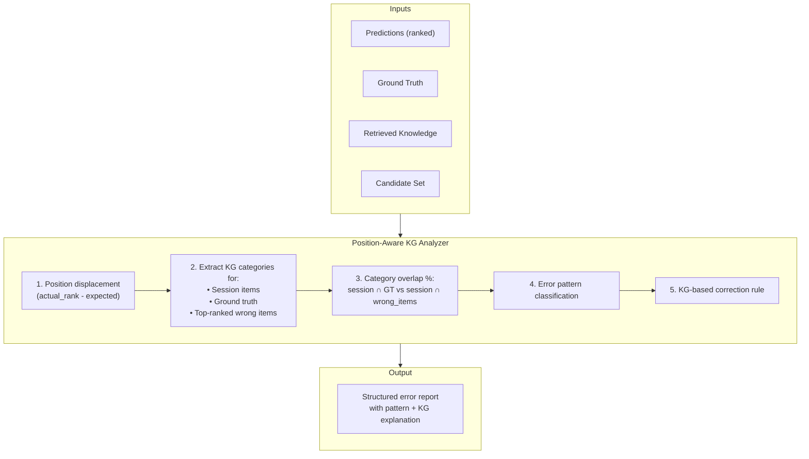

**Error Pattern Classification**:

| Pattern | Trigger | Ý nghĩa |
|---------|---------|---------|
| `CATEGORY_MISMATCH` | Top-3 share 0 categories with session | LLM bỏ qua genre preference |
| `POPULARITY_BIAS` | GT is niche, top items are mainstream | LLM thiên vị popular items |
| `KEYWORD_IGNORED` | GT shares keywords nhưng bị rank thấp | KG keyword signal bị bỏ qua |
| `TEMPORAL_DRIFT` | Session cùng era nhưng result khác era | Temporal coherence bị ignore |
| `INFERRED_ITEM_MISSED` | GT nằm trong KG inferred items nhưng rank thấp | KG inference bị bỏ qua |

**Output format** (gửi cho Optimizer):
```
Failure 1 [CATEGORY_MISMATCH, displacement=+12]:
  Session KG profile: Horror (100%), Gothic (67%)
  Ground truth: Frankenstein → Horror ✅, Gothic ✅ → 100% match
  Wrongly ranked higher:
    Rank 1: Toy Story (Animation, Comedy) → 0% match ❌
    Rank 2: Aladdin (Adventure) → 0% match ❌
  Root cause: Genre dominance ignored
  KG-suggested rule: Boost candidates with ≥50% category overlap
```

---

### Step 2.6 — Optimizer Agent (🔄 cải tiến)

> **File**: [optimizer_agent.py](file:///d:/H_temp/KG4PO/agents/optimizer_agent.py)
> **Status**: 🔄 CẢI TIẾN — retry logic + position-aware KG-grounded feedback template

**Thay đổi**: Human template nhận structured error reports thay vì raw failed cases.

**V1 input cho Optimizer**:
```
3. FAILED CASES:
  - User history: The Body Snatcher, Dracula
    Ground truth: Frankenstein
    Predictions: Toy Story, Aladdin, Lion King
```

**V2 input cho Optimizer**:
```
3. POSITION-AWARE ERROR ANALYSIS (KG-Grounded):
  - Failure 1 [CATEGORY_MISMATCH, displacement=+12]:
    Session KG profile: Horror (100%), Gothic (67%)
    Ground truth: Frankenstein → 100% match ✅
    Rank 1: Toy Story (Animation) → 0% match ❌
    Root cause: Genre dominance ignored
    KG-suggested rule: Boost ≥50% category overlap items
```

**Output** (không đổi format):
```json
{
    "thought_process": "...(analysis)...",
    "new_system_prompt": "...(improved prompt text)...",
    "lesson_learned": {
        "pattern": "category_mismatch",
        "signal": "Session >70% same genre",
        "failure_cause": "Prompt doesn't instruct genre dominance detection",
        "rule": "Boost same-genre candidates by 3+ positions",
        "applicability": "Sessions with strong genre concentration",
        "priority": "high"
    }
}
```

---

### Step 2.7 — Metric-Gated Prompt Acceptance (🆕)

> **Logic trong**: `main.py`
> **Status**: 🆕 MỚI — **Contribution (C3)**

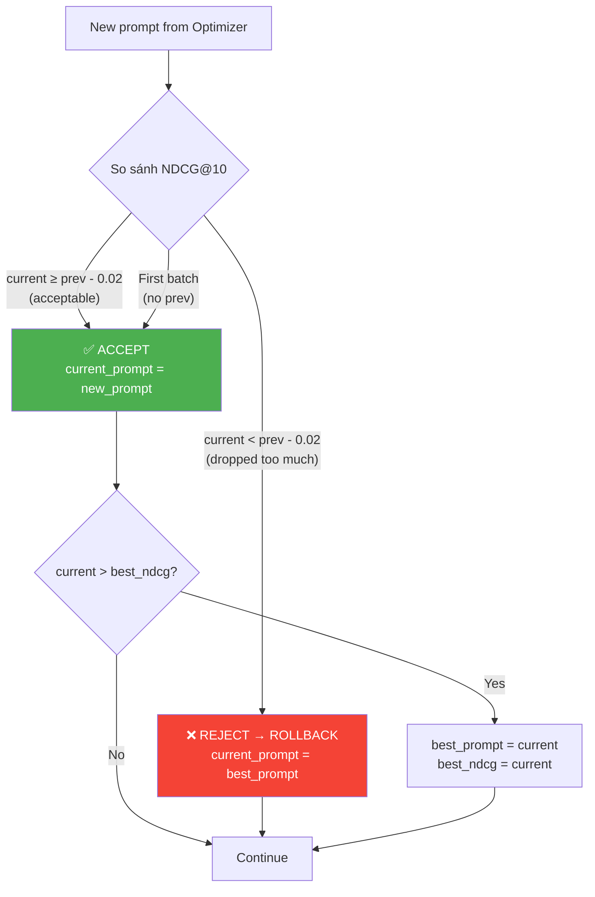

**Logic**:
```python
TOLERANCE = 0.02  # Cho phép giảm tối đa 2%

if prev_ndcg is None:
    # Batch đầu → luôn accept
    current_prompt = new_prompt

elif current_ndcg >= prev_ndcg - TOLERANCE:
    # Ổn định hoặc cải thiện → accept
    current_prompt = new_prompt
    if current_ndcg > best_ndcg:
        best_prompt = new_prompt
        best_ndcg = current_ndcg

else:
    # Giảm mạnh → rollback
    current_prompt = best_prompt

prev_ndcg = current_ndcg
```

**Tại sao tolerance 2%**: Strict improvement requirement (`>=`) dễ bị stuck ở local optimum. Tolerance cho phép exploration nhẹ, rollback an toàn khi drop mạnh.

---

### Step 2.8 — Persistence & Error Bank (🔄 cải tiến)

> **Files**: [memory.py](file:///d:/H_temp/KG4PO/core/memory.py), [error_retriever.py](file:///d:/H_temp/KG4PO/core/error_retriever.py)
> **Status**: 🔄 CẢI TIẾN — lưu tất cả errors + dedup + capacity

**V1**: Chỉ lưu `failed_cases[0]`.

**V2**: Lưu tất cả (max 5/batch), deduplicate, capacity 200:

```python
MAX_ERRORS_PER_BATCH = 5
MAX_BANK_CAPACITY = 200

for fc in failed_cases[:MAX_ERRORS_PER_BATCH]:
    if not error_bank._is_duplicate(fc['session_raw']):  # 80% overlap threshold
        error_bank.add_error(
            session_items=fc['session_raw'],
            ground_truth=fc['target_raw'],
            predictions=fc['predictions'],
            lesson_learned=optimization_result['lesson_learned'],
            error_pattern=fc.get('error_pattern', 'unknown')  # 🆕 from PositionAnalyzer
        )
```

**Deduplication**: 2 errors là duplicate nếu session items overlap > 80%.

**Capacity**: Khi đầy 200, xóa error cũ nhất (FIFO).

**Trajectory Buffer**: Lưu mỗi step → `trajectory_history.json`:
```json
{
    "step": 4,
    "prompt": "(full text)",
    "metrics": {"NDCG@10": 0.35, ...},
    "errors": [...],
    "accepted": true  // 🆕 ghi nhận accept/reject
}
```

End of training: `get_best_record("NDCG@10")` → save best prompt.

---

## 6. Testing Phase

> **File**: [test.py](file:///d:/H_temp/KG4PO/test.py)

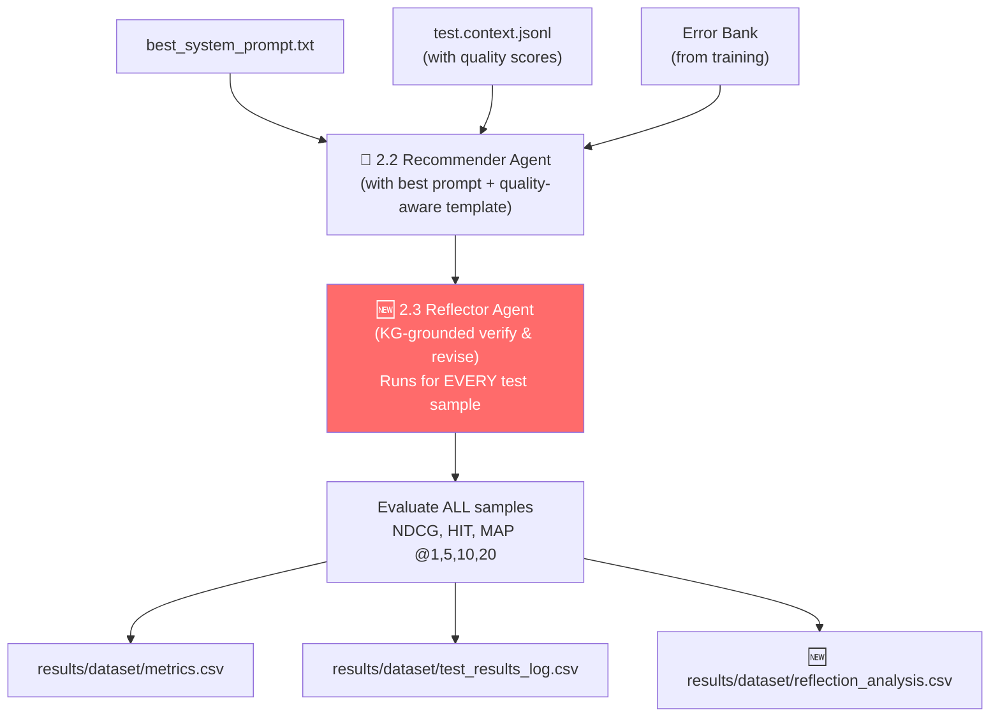

**Khác biệt với training**:
- **Không optimize prompt** — dùng best prompt cố định
- **Reflection luôn chạy** — không thể skip (không biết GT)
- **Error Bank chỉ đọc** — không thêm errors mới
- **🆕 Lưu reflection analysis** — before/after comparison per sample

---

## 7. Output — Kết quả cuối cùng

### Files output

| File | Nội dung |
|------|----------|
| `prompts/best_system_prompt.txt` | Best optimized system prompt |
| `results/<dataset>/metrics.csv` | NDCG, HIT, MAP @1,5,10,20 |
| `results/<dataset>/test_results_log.csv` | Per-sample: input, GT, top-20 predictions |
| `data/<dataset>/trajectory_history.json` | Full optimization history (prompt, metrics per step) |
| `data/<dataset>/error_bank.json` | Accumulated error lessons with patterns |
| 🆕 `results/<dataset>/reflection_analysis.csv` | Before/after reflection per sample |
| 🆕 `results/<dataset>/error_pattern_stats.json` | Error pattern distribution |

### Metrics CSV format
```
KPI@K,  1,      5,      10,     20
NDCG,   0.0832, 0.1654, 0.2147, 0.2891
HIT,    0.0832, 0.2411, 0.3690, 0.5833
MAP,    0.0832, 0.1282, 0.1487, 0.1639
```

---

## 8. Ablation Study Plan

| # | Experiment | KQG | Reflect | PosAware | MetricGate | Expected NDCG |
|---|------------|-----|---------|----------|------------|---------------|
| E1 | Baseline (v1) | ❌ | ❌ | ❌ | ❌ | X (baseline) |
| E2 | + KQG only | ✅ | ❌ | ❌ | ❌ | X + 2-5% |
| E3 | + Metric-Gate only | ❌ | ❌ | ❌ | ✅ | X + 1-2% |
| E4 | + Position-Aware only | ❌ | ❌ | ✅ | ❌ | X + 2-3% |
| E5 | + Reflection only | ❌ | ✅ | ❌ | ❌ | X + 5-8% |
| E6 | + KQG + Reflection | ✅ | ✅ | ❌ | ❌ | X + 8-12% |
| E7 | **+ ALL (v2 full)** | ✅ | ✅ | ✅ | ✅ | **X + 10-18%** |
| E8 | + Reflection w/o KG | ❌ | ✅(no KG) | ❌ | ❌ | X + 2-4% |

**Key ablations**:
- **E2**: Chứng minh bad knowledge đang hurt → chỉ lọc noise đã improve
- **E5 vs E6**: KQG + Reflection compound effect → clean knowledge giúp reflection tốt hơn
- **E5 vs E8**: KG grounding essential, plain self-reflection không đủ

---

## 9. File Changes

### 🆕 Files mới (5 files)

| # | File | Chức năng |
|---|------|-----------|
| 1 | `utils/retry.py` | Retry decorator with exponential backoff |
| 2 | `KG_processed/src/retrieval/idf_calculator.py` | IDF computation + non-discriminative filter |
| 3 | `core/knowledge_quality.py` | Quality scorer + adaptive prompt builder |
| 4 | `agents/reflector_agent.py` | KG-Grounded Self-Reflection Agent |
| 5 | `core/position_analyzer.py` | Position-Aware KG Error Analyzer |

### 🔄 Files cần modify (9 files)

| # | File | Thay đổi |
|---|------|----------|
| 6 | `KG_processed/config.yaml` | Thêm `use_projection`, `idf_threshold` |
| 7 | `KG_processed/src/attention/propagation.py` | Projection-free aggregation option |
| 8 | `KG_processed/src/retrieval/text_synthesizer.py` | Tích hợp IDF filter + quality markers |
| 9 | `KG_processed/src/pipeline.py` | Tích hợp IDF calculator + quality scorer |
| 10 | `agents/recommender_agent.py` | Retry, return reasoning, adaptive KG template |
| 11 | `agents/optimizer_agent.py` | Retry, position-aware feedback template |
| 12 | `core/error_retriever.py` | Dedup, max capacity, error_pattern field |
| 13 | `main.py` | Reflection step, metric-gate, save all errors, quality-aware |
| 14 | `test.py` | Add reflection, quality-aware prompt, reflection log |

---

## 10. Hyperparameters Reference

### Stage 1 (không đổi)
| Parameter | Default | Ý nghĩa |
|-----------|---------|---------|
| `co_occur_window_size` | 5 | Sliding window co-occurrence |
| `embedding.model_name` | all-MiniLM-L6-v2 | Sentence-transformer model |
| `propagation.num_layers` | 3 | Số layers propagation |
| `propagation.aggregator` | bi_interaction | Aggregation method |
| `propagation.dropout` | 0.1 | Dropout rate |
| `propagation.temperature` | 1.0 | Softmax temperature |
| `retrieval.k_categories` | 6 | Max categories per item |
| `retrieval.k_keywords` | 3 | Max keywords per item |
| `retrieval.k_inferred_items` | 3 | Max inferred items |
| `retrieval.layer_decay` | 0.9 | Decay across layers |

### Stage 1 (🆕 thêm mới)
| Parameter | Default | Ý nghĩa |
|-----------|---------|---------|
| `propagation.use_projection` | false | false = projection-free (recommended) |
| `retrieval.idf_threshold` | 1.0 | Categories với IDF < threshold bị loại |
| `quality.high_threshold` | 0.7 | Session quality ≥ này → CONFIDENCE: HIGH |
| `quality.low_threshold` | 0.3 | Session quality < này → CONFIDENCE: LOW |

### Stage 2 (không đổi)
| Parameter | Default | Ý nghĩa |
|-----------|---------|---------|
| `batch_size` | 5 | Samples per batch |
| `max_batches` | None | None = toàn bộ dataset |
| `ACCEPTABLE_RANK` | 8 | Threshold cho failed case |
| `top_k` (error retrieval) | 2 | Số similar errors retrieved |
| `temperature` (LLM) | 0.5 | LLM generation temperature |

### Stage 2 (🆕 thêm mới)
| Parameter | Default | Ý nghĩa |
|-----------|---------|---------|
| `acceptance_tolerance` | 0.02 | Max NDCG drop để vẫn accept |
| `max_errors_per_batch` | 5 | Max errors lưu mỗi batch |
| `max_bank_capacity` | 200 | Tổng Error Bank capacity |
| `dedup_overlap_threshold` | 0.8 | Overlap threshold cho dedup |
| `retry_max_attempts` | 3 | Max LLM retry attempts |
| `retry_base_delay` | 2.0 | Base delay (seconds) |
| `skip_reflection_rank` | 3 | Skip reflection nếu rank ≤ (training only) |
