# KG4PO — System Walkthrough
### Knowledge Graph for Prompt Optimization in LLM-Based Sequential Recommendation

---

## Tổng Quan Kiến Trúc

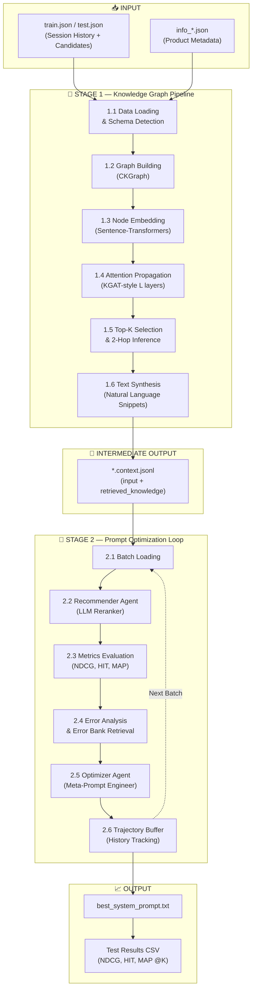

---

## 📥 INPUTS — Dữ liệu đầu vào

### 1. Session Data (`train.json` / `test.json`)

Mỗi file chứa JSON array, mỗi phần tử là 1 session:

```json
{
    "target": "Frankenstein (1931)",
    "target_index": 7,
    "input": "Current session interactions: [1.\"The Body Snatcher (1945)\", 2.\"Dracula (1931)\", 3.\"The Mummy (1932)\"]\nCandidate Set: [1.\"Toy Story (1995)\", 2.\"Aladdin (1992)\", ..., 20.\"Frankenstein (1931)\"]"
}
```

| Field | Ý nghĩa |
|-------|---------|
| `target` | Item đúng mà user sẽ tương tác tiếp theo (ground truth) |
| `target_index` | Vị trí của target trong candidate set (0-indexed) |
| `input` | Chuỗi text chứa 2 phần: session history + candidate set (20 items) |

### 2. Product Info (`info_*.json`)

Metadata về toàn bộ sản phẩm trong corpus:

**Dạng TAXONOMY** (MovieLens 100K):
```json
{
    "title": "Toy Story (1995)",
    "taxonomy": {
        "Level_1": "Animation",
        "Level_2": "Children's Animation",
        "Level_3": "Family Comedy"
    },
    "details": {
        "description": "A cowboy doll is profoundly threatened...",
        "keywords": ["animation", "toys", "friendship"]
    }
}
```

**Dạng CATEGORY** (Games, ML-1M):
```json
{
    "title": "The Legend of Zelda",
    "category": ["Action RPG", "Adventure", "Nintendo"],
    "details": {
        "description": "An action-adventure game...",
        "keywords": ["zelda", "nintendo", "adventure"]
    }
}
```

### Datasets hỗ trợ

| Dataset | Domain | # Items | Schema | Location |
|---------|--------|---------|--------|----------|
| ML-100K | Movies | ~1,682 | TAXONOMY | `data/ml_100k/` |
| ML-1M | Movies | ~3,706 | CATEGORY | `data/ml_1m/` |
| Games | Video Games | ~? | CATEGORY | `data/games/` |
| Bundle | E-commerce | ~? | TAXONOMY | `data/bundle/` |

---

## 🧠 STAGE 1 — Knowledge Graph Pipeline

> **Entry point**: [KG_processed/main.py](file:///d:/H_temp/KG4PO/KG_processed/main.py)
> **Config**: [KG_processed/config.yaml](file:///d:/H_temp/KG4PO/KG_processed/config.yaml)

Stage 1 biến đổi raw data thành **retrieved_knowledge** — chuỗi text tóm tắt thông tin từ Knowledge Graph cho mỗi session. Quá trình gồm 6 bước:

---

### Step 1.1 — Data Loading & Schema Detection

> **Files**: [loader.py](file:///d:/H_temp/KG4PO/KG_processed/src/data/loader.py), [schema_detector.py](file:///d:/H_temp/KG4PO/KG_processed/src/data/schema_detector.py)

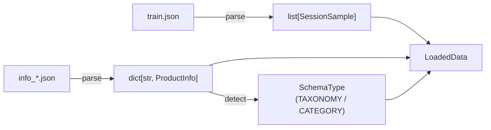

**Chi tiết xử lý**:

1. **Parse sessions**: Đọc `train.json`, mỗi entry được parse thành `SessionSample`:
   - Tách `input` string thành `session_items` và `candidate_items` bằng regex `\d+\."([^"]+)"`
   - Lưu `target`, `target_index`, `raw_input`

2. **Parse products**: Đọc `info_*.json`, mỗi entry thành `ProductInfo`:
   - Extract categories/taxonomy levels tùy schema
   - Extract description (từ `details.description` hoặc `description`)
   - Extract keywords (string → split by comma, hoặc list trực tiếp)

3. **Schema Detection** (tự động, majority vote):
   - Nếu product có field `taxonomy` chứa `Level_*` keys → `SchemaType.TAXONOMY`
   - Nếu có field `category` → `SchemaType.CATEGORY`
   - Vote toàn corpus → lấy majority

**Output**: `LoadedData` chứa `samples`, `products`, `corpus_schema`

---

### Step 1.2 — Graph Building (CKGraph)

> **Files**: [builder.py](file:///d:/H_temp/KG4PO/KG_processed/src/graph/builder.py), [triplet_extractor.py](file:///d:/H_temp/KG4PO/KG_processed/src/graph/triplet_extractor.py), [co_occur_handler.py](file:///d:/H_temp/KG4PO/KG_processed/src/graph/co_occur_handler.py)

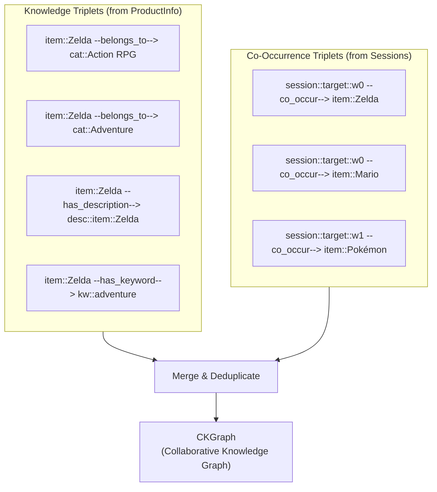

**Step 1.2a — Knowledge Triplet Extraction** (`TripletExtractor`):

Duyệt từng product trong `products` dict, tạo triplets:

| Schema | Relation | Example |
|--------|----------|---------|
| TAXONOMY | `belongs_to_L1`, `belongs_to_L2`, ... | `item::Toy Story → cat::Animation` |
| CATEGORY | `belongs_to` | `item::Zelda → cat::Action RPG` |
| (if enabled) | `has_description` | `item::Zelda → desc::item::Zelda` |
| (if enabled) | `has_keyword` | `item::Zelda → kw::adventure` |

Node ID convention:
- Items: `item::<title>` (e.g., `item::The Legend of Zelda`)
- Categories: `cat::<label>` (e.g., `cat::Action RPG`)
- Descriptions: `desc::item::<title>`
- Keywords: `kw::<keyword>` (lowercased)

**Step 1.2b — Co-Occurrence Triplet Extraction** (`CoOccurHandler`):

Duyệt từng session, tạo **Session Nodes** như intermediary:

**Sliding Window mode** (default, `window_size=5`):
```
Session: [A, B, C, D, E, F, G, H]
                         
Window 0 (items 0-4): session::target::w0 → A, B, C, D, E
Window 1 (items 5-7): session::target::w1 → F, G, H
```

**Full Session mode** (`window_size=null`):
```
Session: [A, B, C, D] → session::target::full → A, B, C, D
```

> 💡 **Tại sao dùng Session Node thay vì direct item-item edges?**
> Direct pairing tạo O(n²) edges. Session Node chỉ tạo O(n) edges, giữ signal co-occurrence qua 2-hop path.

**Step 1.2c — Assemble CKGraph**:

Merge tất cả triplets, build adjacency indexes:

```python
CKGraph:
  ├── triplets:      list[Triplet]           # Tất cả (head, relation, tail) edges
  ├── adjacency:     dict[head → [(rel, tail)]]  # Outgoing edges
  ├── reverse_adj:   dict[tail → [(rel, head)]]  # Incoming edges
  ├── node_types:    dict[node_id → NodeType]
  ├── item_nodes:    set[str]                # Tất cả item nodes
  ├── session_nodes: set[str]                # Tất cả session nodes
  └── category_nodes: set[str]               # Tất cả category/taxonomy nodes
```

**Ví dụ graph statistics**: `nodes=15,234, triplets=48,721, relations=8, items=3,706, categories=1,234`

---

### Step 1.3 — Node Embedding

> **File**: [node_embedder.py](file:///d:/H_temp/KG4PO/KG_processed/src/embedding/node_embedder.py)

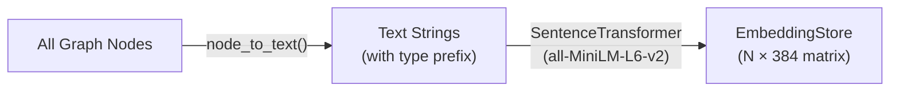

**Chi tiết**:

1. **Text Construction** — Convert mỗi node ID thành text cho encoder:

   | Node Type | Node ID | Generated Text |
   |-----------|---------|----------------|
   | ITEM | `item::Toy Story` | `"Title: Toy Story"` |
   | CATEGORY | `cat::Animation` | `"Category: Animation"` |
   | KEYWORD | `kw::adventure` | `"Keyword: adventure"` |
   | DESCRIPTION | `desc::item::Toy Story` | `"Description: A cowboy doll is..."` |
   | SESSION | `session::target::w0` | `"Viewing session context"` |

2. **Encode** — Dùng `sentence-transformers/all-MiniLM-L6-v2` (384-dim):
   - Batch encoding (256 texts/batch) trên GPU
   - L2-normalize embeddings (cho cosine similarity)

3. **Output**: `EmbeddingStore` chứa:
   - `matrix`: numpy array shape `(N_nodes, 384)`, dtype float32
   - `node2idx` / `idx2node`: bidirectional lookup

---

### Step 1.4 — Attention Propagation (KGAT-style)

> **Files**: [attention_scorer.py](file:///d:/H_temp/KG4PO/KG_processed/src/attention/attention_scorer.py), [propagation.py](file:///d:/H_temp/KG4PO/KG_processed/src/attention/propagation.py)

Đây là core của hệ thống KG — truyền tin (message passing) qua L layers trên graph.

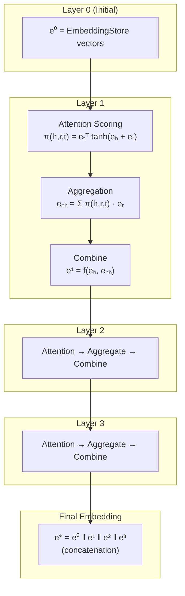

**Step 1.4a — Attention Scoring** (`AttentionScorer`):

Cho mỗi node `h` và neighbor `t` kết nối bởi relation `r`:

```
score(h, r, t) = eₜᵀ · tanh(eₕ + eᵣ)
```

Trong đó `eᵣ` = mean embedding của tất cả tail nodes connected qua relation `r` (relation context vector, pre-computed 1 lần).

Scores được normalize bằng **softmax với temperature**:

```
π(h, r, t) = softmax(score / temperature)
```

**Step 1.4b — Neighbor Aggregation**:

```
eₙₕ = Σ_t π(h,r,t) · eₜ     (attention-weighted sum of all neighbors)
```

**Step 1.4c — Combine (Aggregator)**:

3 aggregator options:

| Aggregator | Formula | Note |
|------------|---------|------|
| **bi_interaction** (default) | `LeakyReLU(W₁(eₕ + eₙₕ)) + LeakyReLU(W₂(eₕ ⊙ eₙₕ))` | Best in KGAT paper |
| gcn | `LeakyReLU(W₁(eₕ + eₙₕ))` | Simpler |
| graphsage | `LeakyReLU(W₁[eₕ ‖ eₙₕ])` | Concat-based |

> ⚠️ W₁, W₂ hiện tại là random initialized, chưa được train.

**Step 1.4d — Dropout**: Inverted dropout với rate 0.1 (configurable).

**Step 1.4e — Final Embedding**: Concatenate tất cả layers:

```
e*(node) = e⁰(node) ‖ e¹(node) ‖ e²(node) ‖ e³(node)
```

Nếu dim=384 và L=3 → final dim = 384 × 4 = 1,536.

**Output**: `PropagationResult` chứa:
- `layer_embeddings[l][node_id]` — embedding tại mỗi layer
- `attention_records[l][head_id]` — attention weights `[(rel, tail, weight)]`
- `final_embeddings[node_id]` — concatenated final embedding

---

### Step 1.5 — Top-K Selection & 2-Hop Inference

> **File**: [topk_selector.py](file:///d:/H_temp/KG4PO/KG_processed/src/retrieval/topk_selector.py)

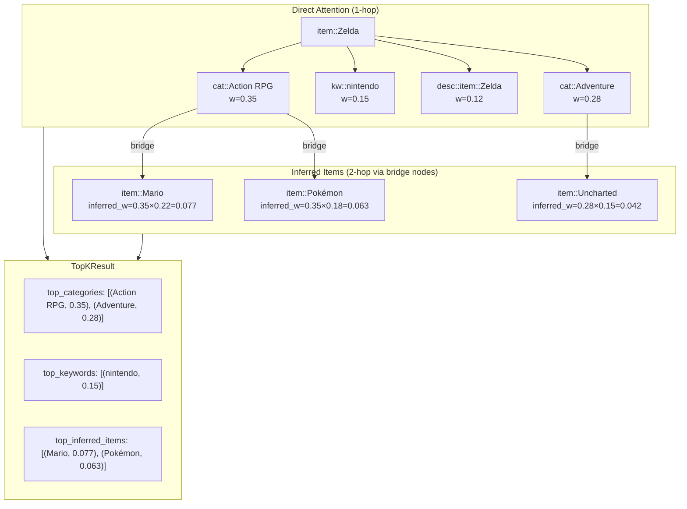

**Step 1.5a — Direct Weight Aggregation**:

Cho mỗi item node, tổng hợp attention weights qua tất cả layers với layer decay:

```python
accumulated[tail] += weight × (decay ^ layer_idx)
# decay = 0.9 → shallow layers được ưu tiên hơn deep layers
```

Phân loại neighbors theo type:
- Categories → `top_categories` (top k_categories=6)
- Keywords → `top_keywords` (top k_keywords=3)
- Descriptions → `top_descriptions` (top k_descriptions=1)

**Step 1.5b — 2-Hop Inferred Items** (genuine graph inference):

Đây là điểm quan trọng — tìm items **không nằm trong session** nhưng connected qua bridge nodes:

```
item::Zelda --[belongs_to]--> cat::Action RPG <--[belongs_to]-- item::Mario
              (w1 = 0.35)                        (w2 = 0.22)
              
inferred_weight(Zelda → Mario) = w1 × w2 = 0.077
```

Logic:
1. Lấy tất cả category/keyword neighbors của focal item (bridge nodes)
2. Cho mỗi bridge node, tìm tất cả items khác connected tới nó (reverse adjacency)
3. Loại bỏ items đã có trong session
4. Score = `w(focal→bridge) × w(bridge→item)`
5. Lấy top `k_inferred_items=3`

**Output**: `TopKResult` per item, chứa top categories, keywords, inferred items.

---

### Step 1.6 — Text Synthesis

> **File**: [text_synthesizer.py](file:///d:/H_temp/KG4PO/KG_processed/src/retrieval/text_synthesizer.py)

Biến `TopKResult` thành **natural language snippet** cho LLM consume.

**Template**:
```
- Item '<title>' belong to categories: <C1>, <C2>; with keywords: <K1>, <K2>; related items: <I1>, <I2>.
```

**Ví dụ output cho 1 session**:

```
- Item 'The Body Snatcher' belong to categories: Gothic Romances, Horror; 
  with keywords: horror, thriller, suspense; related items: Dracula, Frankenstein.
- Item 'Dracula' belong to categories: Horror, Classic Horror; 
  with keywords: vampire, gothic; related items: The Mummy, Nosferatu.
- Item 'The Mummy' belong to categories: Horror, Adventure Horror; 
  with keywords: egypt, curse; related items: Indiana Jones, The Mummy Returns.
```

**Logic chi tiết**:
1. Duyệt từng item trong session
2. Nếu có `TopKResult` → build snippet từ graph attention data:
   - Categories: lấy most specific (longest name) + top attention weights → max 4
   - Keywords: từ graph attention → max 3
   - Inferred items: từ 2-hop inference → max 3
3. Nếu không có TopKResult (item không trong graph) → fallback sang `ProductInfo` lookup
4. Join tất cả snippets bằng space

---

### Stage 1 Output — `*.context.jsonl`

Mỗi dòng là 1 JSON object:

```json
{
    "target": "Frankenstein (1931)",
    "target_index": 7,
    "input": "Current session interactions: [1.\"The Body Snatcher\"...]\nCandidate Set: [1.\"Toy Story\"...]",
    "retrieved_knowledge": "- Item 'The Body Snatcher' belong to categories: Gothic Romances, Horror; with keywords: horror, thriller; related items: Dracula, Frankenstein. - Item 'Dracula' belong to categories: Horror, Classic Horror; with keywords: vampire, gothic."
}
```

| Field | Source | Ý nghĩa |
|-------|--------|---------|
| `target` | Giữ nguyên từ input | Ground truth item |
| `target_index` | Giữ nguyên từ input | Vị trí target trong candidates |
| `input` | Giữ nguyên từ input | Session + Candidates text |
| `retrieved_knowledge` | **MỚI — từ KG Pipeline** | KG-inferred context cho LLM |

---

## 🤖 STAGE 2 — Prompt Optimization Loop

> **Entry point**: [main.py](file:///d:/H_temp/KG4PO/main.py) (train), [test.py](file:///d:/H_temp/KG4PO/test.py) (test)
> **LLM Provider**: Configurable (OpenAI / DeepInfra / TimelyGPT)

Stage 2 sử dụng output của Stage 1 để **tự động tối ưu system prompt** qua vòng lặp iterative.

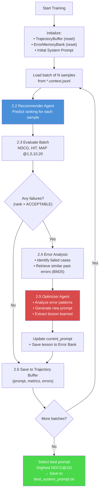

---

### Step 2.1 — Batch Loading

> **File**: [main.py](file:///d:/H_temp/KG4PO/main.py) — `load_jsonl_batches()`

Load `*.context.jsonl` theo streaming batches:

```python
batch_size = 5       # Số samples mỗi batch (configurable)
max_batches = None   # None = toàn bộ dataset
```

Mỗi sample trong batch chứa:
- `input` → sẽ được tách thành `session_str` và `candidate_str`
- `target` → ground truth
- `retrieved_knowledge` → KG context từ Stage 1

**Parsing input string**:
```python
parts = input_str.split('\nCandidate Set:')
session_str = parts[0].replace('Current session interactions:', '').strip()
candidate_str = parts[1].strip()
session_items = re.findall(r'\d+\."([^"]+)"', session_str)  # List dạng ["Item A", "Item B"]
```

---

### Step 2.2 — Recommender Agent (LLM Reranker)

> **File**: [recommender_agent.py](file:///d:/H_temp/KG4PO/agents/recommender_agent.py)

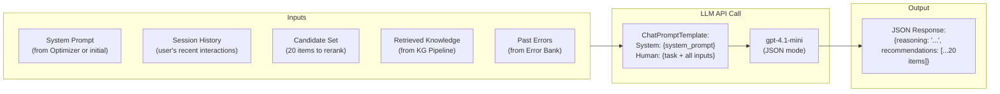

**Prompt Structure**:

```
┌─────────── SYSTEM MESSAGE ───────────┐
│ {system_prompt}                       │
│ (Dynamic — optimized by Optimizer)    │
├─────────── HUMAN MESSAGE ────────────┤
│ This is a game recommendation task... │
│                                       │
│ 1. Session History:                   │
│    {session_items}                    │
│                                       │
│ 2. Candidate Set (RERANK THESE 20):   │
│    {candidate_set}                    │
│                                       │
│ 3. Knowledge Graph Context:           │
│    {retrieved_knowledge}              │
│                                       │
│ 4. Past Errors to Avoid:              │
│    {past_errors}                      │
│                                       │
│ RULES: Return JSON with reasoning     │
│ + recommendations list of 20 items    │
└───────────────────────────────────────┘
```

**LLM Response (parsed)**:
```json
{
    "reasoning": "User shows interest in horror/gothic films from 1930s...",
    "recommendations": [
        "Frankenstein (1931)",    // ← Rank 1
        "The Invisible Man",     // ← Rank 2
        "Bride of Frankenstein", // ← Rank 3
        ... // 20 items total
    ]
}
```

**Error Handling**: Nếu JSON parse fail → trả về `[]` (empty list).

---

### Step 2.3 — Metrics Evaluation

> **File**: [metrics.py](file:///d:/H_temp/KG4PO/core/metrics.py)

**Step 2.3a — Get Rank**: Tìm vị trí của ground truth trong predicted list:

```python
def get_rank(predictions, ground_truth):
    # Normalize cả 2 (lowercase, remove quotes, numbering, special chars)
    gt_norm = normalize("Frankenstein (1931)")  # → "frankenstein(1931)"
    for idx, pred in enumerate(predictions):
        if normalize(pred) == gt_norm:
            return idx + 1     # 1-indexed rank
    return 999                 # Not found
```

**Step 2.3b — Compute Metrics**: Cho toàn batch:

| Metric | Formula | Ý nghĩa |
|--------|---------|---------|
| **NDCG@K** | `1/log₂(rank+1)` if rank ≤ K, else 0 | Normalized Discounted Cumulative Gain |
| **HIT@K** | `1` if rank ≤ K, else `0` | Hit Rate (binary) |
| **MAP@K** | `1/rank` if rank ≤ K, else `0` | Mean Average Precision |

Tính tại các cutoffs: `@1, @5, @10, @20`

**Ví dụ output**:
```python
{
    'NDCG@1': 0.20, 'NDCG@5': 0.35, 'NDCG@10': 0.42, 'NDCG@20': 0.48,
    'HIT@1': 0.20,  'HIT@5': 0.40,  'HIT@10': 0.60,  'HIT@20': 0.80,
    'MAP@1': 0.20,  'MAP@5': 0.28,  'MAP@10': 0.32,  'MAP@20': 0.35
}
```

---

### Step 2.4 — Error Analysis & Error Bank

> **File**: [error_retriever.py](file:///d:/H_temp/KG4PO/core/error_retriever.py)

**Step 2.4a — Identify Failed Cases**:

```python
ACCEPTABLE_RANK = 8
if rank > ACCEPTABLE_RANK:
    failed_cases.append({
        "session_raw": ["The Body Snatcher", "Dracula"],    # Session items
        "target_raw": "Frankenstein",                        # Ground truth
        "predictions": ["Toy Story", "Aladdin", ...],       # Top-10 predictions
        "actual_rank": 15                                    # Where GT actually ranked
    })
```

**Step 2.4b — Retrieve Similar Past Errors** (BM25):

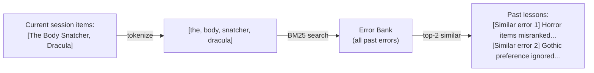

**BM25 Parameters**: `k1=1.2, b=0.5, epsilon=0.25`

**Formatted output**:
```
[Similar error 1]
- History interactions: The Body Snatcher → Dracula
- Ground truth: Frankenstein
- Wrong prediction: Toy Story, Aladdin, Lion King
- Lesson learned: {"pattern": "genre_mismatch", "rule": "Prioritize horror/gothic..."}

[Similar error 2]
- History interactions: Nosferatu → The Mummy
- Ground truth: Bride of Frankenstein
- Lesson learned: {...}
```

---

### Step 2.5 — Optimizer Agent (Meta-Prompt Engineer)

> **File**: [optimizer_agent.py](file:///d:/H_temp/KG4PO/agents/optimizer_agent.py)

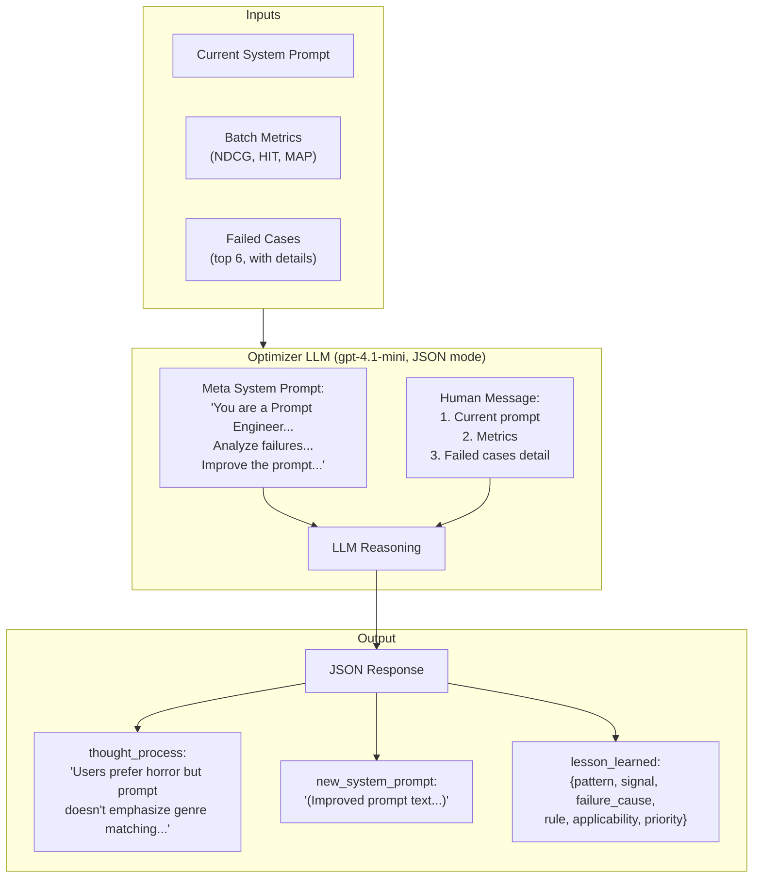

**Optimizer nhận**:
1. Current system prompt (text)
2. Metrics dict (JSON)
3. Top 6 failed cases với detail:
   - User history
   - Ground truth (actual next item)
   - System's wrong predictions

**Optimizer trả về**:
```json
{
    "thought_process": "The current prompt doesn't adequately handle genre-specific preferences. Failed cases show horror films being ranked below comedies...",
    "new_system_prompt": "(Complete improved prompt text...)",
    "lesson_learned": {
        "pattern": "genre_preference_ignored",
        "signal": "Session dominated by single genre (>70% same genre)",
        "failure_cause": "Prompt doesn't instruct model to detect genre dominance",
        "rule": "When >70% session items share a genre, boost same-genre candidates by 3+ positions",
        "applicability": "Any session with strong genre concentration",
        "priority": "high"
    }
}
```

**Constraints trên Optimizer**:
- Modify prompt thay vì viết lại hoàn toàn
- Không include specific item titles từ failed cases
- Prompt mới phải general và reusable
- Tránh overfitting cho specific examples

---

### Step 2.6 — Trajectory Buffer & Persistence

> **File**: [memory.py](file:///d:/H_temp/KG4PO/core/memory.py)

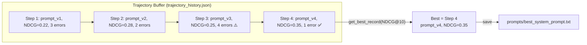

**Record format**:
```json
{
    "step": 4,
    "prompt": "(full prompt text)",
    "metrics": {"NDCG@1": 0.20, "NDCG@5": 0.30, "NDCG@10": 0.35, ...},
    "errors": [{"session_raw": [...], "target_raw": "...", "predictions": [...]}]
}
```

**End of training**: `get_best_record("NDCG@10")` → lấy prompt có NDCG@10 cao nhất → save to file.

---

## 📈 TESTING PHASE

> **File**: [test.py](file:///d:/H_temp/KG4PO/test.py)

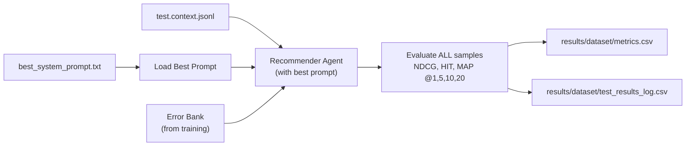

Test phase **không optimize prompt**. Nó dùng prompt tốt nhất từ training + Error Bank đã tích lũy:

1. Load `best_system_prompt.txt`
2. Load Error Bank (không reset, giữ lessons từ training)
3. Cho mỗi test sample:
   - Retrieve past error lessons (BM25)
   - Predict với best prompt + past errors
4. Evaluate toàn bộ test set
5. Output metrics CSV + raw predictions log

---

## 📊 OUTPUTS

### 1. Best System Prompt
```
prompts/best_system_prompt.txt
```
Full text của system prompt đã được optimize qua training loop.

### 2. Metrics Summary CSV
```
results/<dataset>/gpt4_L3.csv
```
```
KPI@K,  1,      5,      10,     20,     #valid_data
NDCG,   0.0832, 0.1654, 0.2147, 0.2891, 187
HIT,    0.0832, 0.2411, 0.3690, 0.5833, 0
MAP,    0.0832, 0.1282, 0.1487, 0.1639, 0
```

### 3. Raw Predictions Log
```
results/<dataset>/test_results_log.csv
```
CSV chứa mỗi test sample: Input, Ground Truth, Top-20 Predictions.

### 4. Training Artifacts
```
data/<dataset>/trajectory_history.json  — Full optimization history
data/<dataset>/error_bank.json          — All accumulated error lessons
```

---

## 🔄 Data Flow Summary (End-to-End)

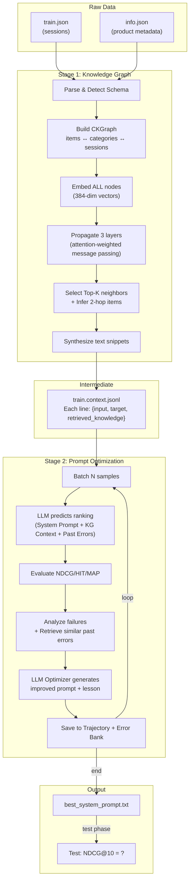

---

## ⚙️ Hyperparameters Reference

### Stage 1 (KG Pipeline)
| Parameter | Default | Location | Ý nghĩa |
|-----------|---------|----------|---------|
| `co_occur_window_size` | 5 | config.yaml | Sliding window cho co-occurrence |
| `embedding.model_name` | all-MiniLM-L6-v2 | config.yaml | Sentence-transformer model |
| `embedding.device` | cuda | config.yaml | GPU/CPU |
| `propagation.num_layers` | 3 | config.yaml | Số layers propagation (L) |
| `propagation.aggregator` | bi_interaction | config.yaml | Aggregation method |
| `propagation.dropout` | 0.1 | config.yaml | Dropout rate |
| `propagation.temperature` | 1.0 | config.yaml | Softmax temperature |
| `retrieval.k_categories` | 6 | config.yaml | Max categories per item |
| `retrieval.k_keywords` | 3 | config.yaml | Max keywords per item |
| `retrieval.k_inferred_items` | 3 | config.yaml | Max inferred items per item |
| `retrieval.layer_decay` | 0.9 | config.yaml | Decay factor across layers |

### Stage 2 (Prompt Optimization)
| Parameter | Default | Location | Ý nghĩa |
|-----------|---------|----------|---------|
| `batch_size` | 5 | main.py | Samples per optimization batch |
| `max_batches` | None | main.py | Max batches (None=all) |
| `ACCEPTABLE_RANK` | 8 | main.py | Threshold cho failed case |
| `top_k` (error retrieval) | 2 | main.py | # similar errors retrieved |
| `temperature` (LLM) | 0.5 | llm.py | LLM generation temperature |
| `BM25 k1` | 1.2 | error_retriever.py | BM25 term frequency param |
| `BM25 b` | 0.5 | error_retriever.py | BM25 length normalization |
